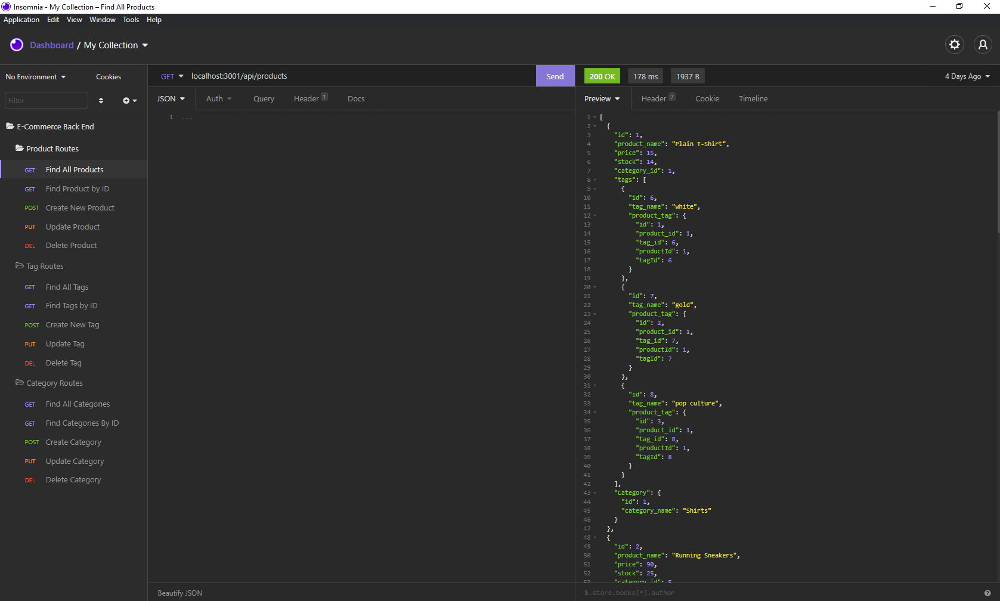

# **E-Commerce Backend**

### _Using Express to create API routes for an E-Commerce site backend, this app uses Node to communicate with mysql2 to send data to the database with JS._

## [](https://opensource.org/licenses/Apache-2.0)

## Mock Up



#### Command Line Video Link: https://drive.google.com/file/d/1b4qNP5Pe_WiU3uFYeErRe65dDHttP23_/view?usp=sharing

#### Insomnia Video Link: https://drive.google.com/file/d/1n_plKSLNTmtWiY_RxYL1JqEm_eEJGgLR/view?usp=sharing

## Table of Contents

1. [Installation](#installation)

2. [Usage](#usage)

3. [Contributing](#contributing)

4. [Test](#test)

5. [Questions](#questions)

## Installation

1. Download the app from my repo.
2. Run npm i to install all required packages (dotenv, mysql2, sequelize, and express).

```
npm i
```

3. Add your own .env file with your mysql username and password.
4. Create the database by navigating to the /db folder and running the schema.sql file after logging in to mysql.

```
source schema.sql
```

4. Seed the Database

```
npm seed
```

## Usage

Use this app as a backend for E-Commerce-type sites where you need a database with products, categories, and tags.

## Contributing

None

## Test

This application has no tests.

## Questions

Email: parkers205@gmail.com

GitHub: https://github.com/parkersatterfield

---

## License Information

APACHE 2.0 (Not really, I am just showing of my README generator app).
